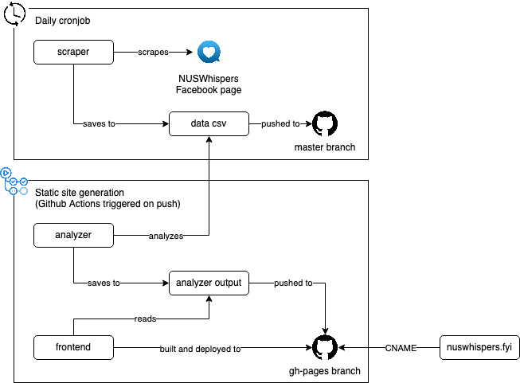

# NUSWhispers Analysis - nuswhispers.fyi

Analyzes NUSWhispers' anonymized confessions Facebook posts.

Check out the [about section](https://nuswhispers.fyi/#about) for more details on what this project is about.

This project was a [submission for Hack&Roll 2021](https://devpost.com/software/analysis-on-nuswhispers-confessions). The v1 folder contains the submitted version.

## How it works



### Scraper

The scraper consists of 3 scripts:

- post-id-scraper.py scrapes the post ids off the NUSWhispers Facebook page and saves to `post-ids.csv`.
- converter.py scrapes the details of each post of based on the post ids and saves contiguous chunks of posts to `data/data-[start index]-[end index].csv`.
- merger.py merges the chunks of posts csv files into a single csv as `data/data-[start index]-[end index].csv`.

Initially, the scraper was meant to be run using Github Actions configured in `.github/workflows/collect.yml` which worked for some time but I think Facebook blocked Github Actions runners from accessing it.

### Analyzer

The analyzer script reads the data csv file and generates the files to be visualized by the frontend, specifically:

- overview
- top posts by metric and time range
- posts frequency by time range
- metrics distribution by metric
- metrics medians by metric and time range
- top terms for all time and by week
- top most mentioned, biggest and longest networks

It uses [numpy](https://numpy.org/), [pandas](pandas.pydata.org/), [nltk](https://www.nltk.org/) and [sklearn](https://scikit-learn.org/).

### Frontend

The frontend is a static React single page app for vizualizing the results of the analysis. It is made using [React](https://reactjs.org/) and [Tailwind](tailwindcss.com/), as well as [uPlot](https://github.com/leeoniya/uPlot/) for charts, [wordcloud2.js](https://github.com/timdream/wordcloud2.js) for wordclouds and [vis-network](https://github.com/visjs/vis-network) for network graphs.

## Getting started

### Run the scraper

This is to update the data csv file under `scraper/data/data-*-*.csv`.

Install the dependencies

```
cd scraper
python -m venv .venv
. .venv/bin/activate
pip install -r requirements.txt
```

Run the scraper scripts

```
python post-id-scraper.py
python converter.py
python merger.py
```

### Run the analyzer

```
python analyzer.py
```

This will produce the `analyzer-output` folder containing json and csv files to be fetched by the frontend.

### Run the frontend

```
cd frontend
yarn start
```

Go to http://localhost:3000

### Setup the cronjob

Every day at 12pm, run the scraper and push to master.

```
0 12 * * * (cd <project dir>/scraper/; .venv/bin/python post-id-scraper.py >/dev/null 2>&1; .venv/bin/python converter.py >/dev/null 2>&1; .venv/bin/python merger.py >/dev/null 2>&1; git checkout master; git add -u data/; git add post-ids.csv data/data-0_ index-last-changed.csv; git commit -qm "Update data $(date +'\%Y-\%m-\%dT\%H:\%M:\%S%Z:00')"; git push origin master;)
```

## Notes

I decided to store the data as a csv file instead of storing it in a database as it is simpler for analysis and I don't want to host a database. Also I can use git to version the file. The big number of tags, releases and action runs are due to initial experiments using Github Actions to scrape and using the releases as a way to store the data artifacts. Currently, only the Deploy Github Pages action is actively used. Everything is kept as is for archival purpose.

## License

This project is licensed under the MIT License - see the [LICENSE](LICENSE) file for details
